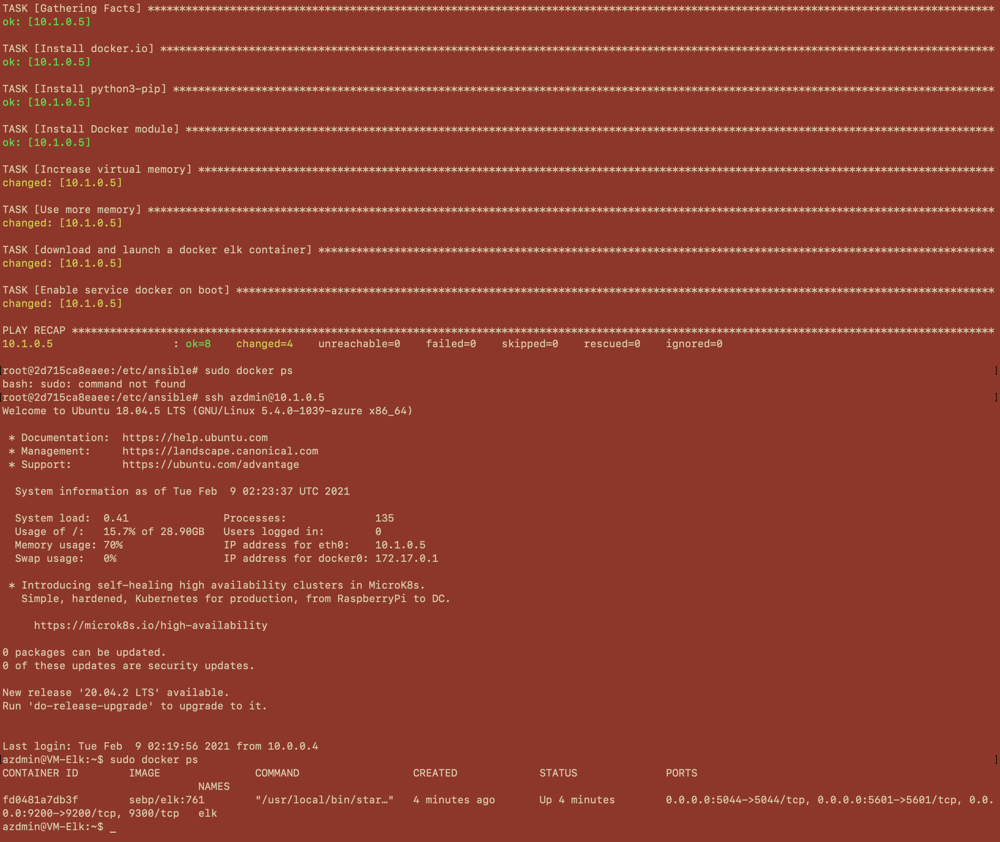

## Automated ELK Stack Deployment

The files in this repository were used to configure the network depicted below.

These files have been tested and used to generate a live ELK deployment on Azure. They can be used to either recreate the entire deployment pictured above. Alternatively, select portions of the playbook file may be used to install only certain pieces of it, such as Filebeat.

  - _TODO: Enter the playbook file.
  /etc/ansible/playbook.yml

This document contains the following details:
- Description of the Topology
- Access Policies
- ELK Configuration
  - Beats in Use
  - Machines Being Monitored
- How to Use the Ansible Build

### Description of the Topology

The main purpose of this network is to expose a load-balanced and monitored instance of DVWA, the D*mn Vulnerable Web Application.

Load balancing ensures that the application will be highly available, in addition to restricting inbound requests to the network.
- _TODO: What aspect of security do load balancers protect? What is the advantage of a jump box?
Load balancers protects the system from DDoS attacks by shifting attack traffic. The advantage of a jump box is to give access to the user from a single node that can be secured and monitored.

Integrating an ELK server allows users to easily monitor the vulnerable VMs for changes to the file systems traffic and system metrics.
- _TODO: What does Filebeat watch for?
Filebeat watches for log files/locations and collects log events.
- _TODO: What does Metricbeat record?
Metricbeat records metrics and statistics

The configuration details of each machine may be found below.
_Note: Use the [Markdown Table Generator](http://www.tablesgenerator.com/markdown_tables) to add/remove values from the table.

| Name     | Function | IP Address | Operating System |
|----------|----------|------------|------------------|
| Jump Box | Gateway  | 10.0.0.4  | Linux             |
| Web-1    | DVWA 1   | 10.0.0.7  | Linux             |
| Web-2    | DVWA 2   | 10.0.0.6  | Linux             |
| VM-Elk   | Monitor  | 10.1.0.5  | Linux             |

### Access Policies

The machines on the internal network are not exposed to the public Internet. 

Only the Jumpbox machine can accept connections from the Internet. Access to this machine is only allowed from the following IP addresses:
- _TODO: Add whitelisted IP addresses
Jumbox IP: 52.149.214.24

Machines within the network can only be accessed by each other.
- _TODO: Which machine did you allow to access your ELK VM? What was its IP address? Elk VM -IP address: 10.1.0.5

A summary of the access policies in place can be found in the table below.

| Name     | Publicly Accessible | Allowed IP Addresses |
|----------|---------------------|----------------------|
| Jump Box | Yes                 |   52.149.214.24      |
| Web-1    | No                  |    10.0.0.4          |
| Web-2    | No                  |    10.0.0.4          |
| VM-Elk   | No                  |    10.0.0.4          |
### Elk Configuration

Ansible was used to automate configuration of the ELK machine. No configuration was performed manually, which is advantageous because...
- _TODO: What is the main advantage of automating configuration with Ansible?
The primary benefit of Ansible is it allows IT administrators to automate away the drudgery from their daily tasks. That frees them to focus on efforts that help deliver more value to the business by spending time on more important tasks.

The playbook implements the following tasks:
- _TODO: In 3-5 bullets, explain the steps of the ELK installation play. E.g., install Docker; download image; etc._
- Intall: docker.io
- Install: python-pip
- Install: docker
- Command: sysctl -w vm.max_map_count=262144
- Launch docker container: elk

The following screenshot displays the result of running `docker ps` after successfully configuring the ELK instance.

### Target Machines & Beats
This ELK server is configured to monitor the following machines:
- _TODO: List the IP addresses of the machines you are monitoring
Web-1 10.0.0.7
web-2 10.0.0.6

We have installed the following Beats on these machines:
- _TODO: Specify which Beats you successfully installed
Filebeat and Metricbeat

These Beats allow us to collect the following information from each machine:
- _TODO: In 1-2 sentences, explain what kind of data each beat collects, and provide 1 example of what you expect to see. E.g., `Winlogbeat` collects Windows logs, which we use to track user logon events, etc.
Filebeat collects the changes done 
Metric beat collects metrics and statistics 

### Using the Playbook
In order to use the playbook, you will need to have an Ansible control node already configured. Assuming you have such a control node provisioned: 

SSH into the control node and follow the steps below:
- Copy the playbook.yml file to /etc/ansible/roles/playbook.yml.
- Update the hosts file to include VM-Elk destination IP: 10.1.0.5
- Run the playbook, and navigate to http://137.116.78.202:5601/app/kibana to check that the installation worked as expected.

_TODO: Answer the following questions to fill in the blanks:
- _Which file is the playbook? Where do you copy it?
/etc/ansible/file/filebeat-configuration.yml
- _Which file do you update to make Ansible run the playbook on a specific machine? How do I specify which machine to install the ELK server on versus which to install Filebeat on?
edit the /etc/ansible/host file to add webserver/elkserver ip addresses

- _Which URL do you navigate to in order to check that the ELK server is running?

http://137.116.78.202:5601/app/kibana

_As a **Bonus**, provide the specific commands the user will need to run to download the playbook, update the files, etc._
ansible-playbook filebeat-playbook.yml
